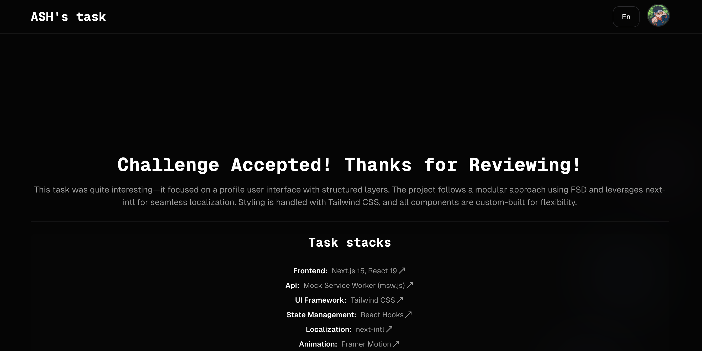

<div align="center">
  <h1><samp>Technical task</samp></h1>
  <samp>Showcasing my coding skills and projects with a sleek, modern design.<br /> Built using the latest web technologies to demonstrate my expertise and creativity</samp>
</div>

## Stack technologies

- [React](https://react.dev/learn) + [Typescript](https://www.typescriptlang.org/docs/)
- [React Hook Form](https://react-hook-form.com/) - Performant, flexible and extensible forms with
- [React Query](https://tanstack.com/query) - Automatically caches data from your queries, reducing the need for redundant network requests and improving application performance.
- [Tailwindcss](https://tailwindcss.com) - For styles
- [Nextjs](https://Nextjs.org/) - framework for SSR

## Basic requirements for the project

> [!NOTE]
> Version Node +v20\*

## For Developers

## Prerequisites

- Node.js (v20+)
- pnpm

## Installation

```bash
# Clone the repository
git clone https://github.com/warnigo/technical-task.git

# Navigate to project directory
cd technical-task

# Install dependencies
pnpm install

# Copy environment template
cp .env.example .env.development

# Run development server
pnpm dev
```

Run the project at [localhost:3000](http://localhost:3000)

> [!NOTE]
> You need to create `.env.development` following the example of `.env.example` so that all parameters are

## Project structure (we will describe large sections separately inside the folder)

```
Root
├── .hasky - Prehooks for commits
├── public - All public files that will be included in the production build
├── messages - All project language words are formed in this folder!
├── src - Development folder
│   │
│   ├── app - Here is the entire project structure by structure
│   ├── entities - Components common to the project that are not included in the ui
│   ├── mocks - Common constants for the project that are used throughout the project
│   ├── views - All page of the project, that is, all pages, the main code is created in this folder
│   ├── shared - Components that are used throughout the project
│   └── widgets- Contains reusable UI components and widget implementations
│
├── .env.example - Example of environment variables for production.
├── .gitignore - Specifies which files and directories to ignore in Git.
├── .npmrc - Configuration for npm, including registry settings and package behaviors.
├── .prettierrc - Configuration for Prettier formatting.
├── eslint.config.mjs - Configuration for ESLint.
├── tailwind.config.ts - Configuration for tailwind.
├── next.config.ts - Configuration settings for Next.js.
├── package.json - List of project dependencies and scripts.
├── postcss.config.cjs - Configuration for PostCSS.
└── tsconfig.json - Configuration for TypeScript
```

## Internationalization

Supported languages:

- English
- Uzbek
- Russian

Language files are located in `messages/` directory.

## Deployment

```bash
# Build for production
pnpm build

# Preview production build
pnpm start
```

## Creator

Developed by **Warnigo**

- Website: [warnigo.uz](https://www.warnigo.uz)
- Email: thewarnigo@gmail.com
